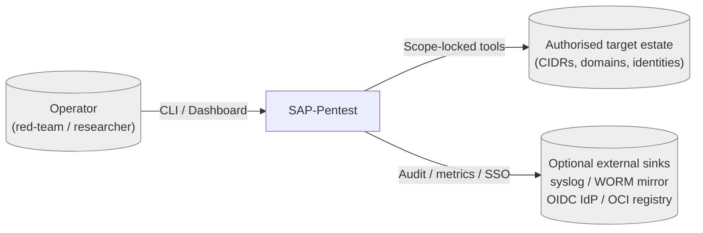
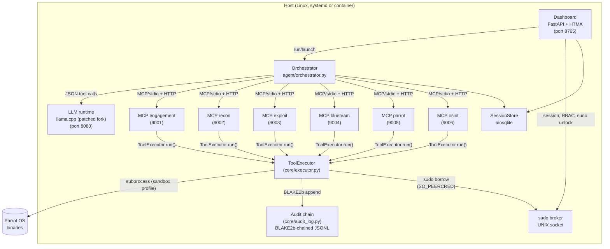
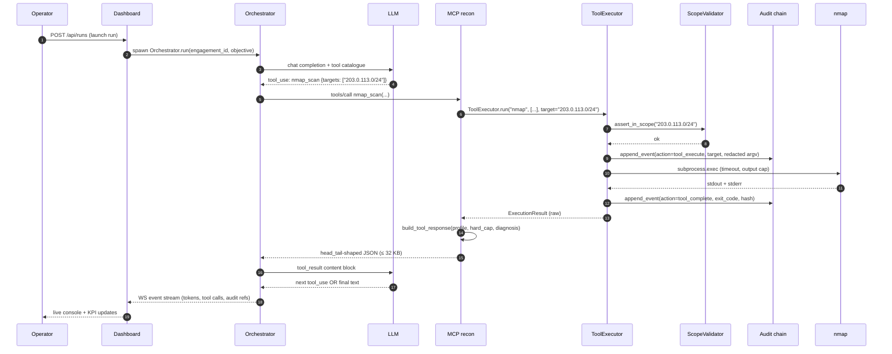

# SAP-Pentest — Architecture

> Target audience: contributors, security auditors, operators evaluating
> whether to adopt SAP-Pentest. This document is the **canonical English
> overview** of the runtime architecture. The full engineering log lives
> in [`PENTEST_AGENT_MCP_SPEC.it.md`](../PENTEST_AGENT_MCP_SPEC.it.md)
> (Italian); the English mirror at
> [`PENTEST_AGENT_MCP_SPEC.en.md`](../PENTEST_AGENT_MCP_SPEC.en.md) is
> a work-in-progress translation.

## 1. System context (C4 — Level 1)



The operator drives engagements through the dashboard (browser) or the
`sap-pentest` CLI. Every active probe — port scan, DNS lookup,
exploitation primitive, OSINT query — is dispatched by SAP-Pentest's
orchestrator and runs only against assets the operator has declared in
scope. Audit, metrics and SSO collaborators are optional and external.

## 2. Containers (C4 — Level 2)



Components:

* **Dashboard** — FastAPI + HTMX/Alpine SPA. Hosts engagement
  management, audit timeline, sudo-unlock gate, KPIs. Auth via
  HttpOnly cookie sessions with CSRF double-submit; RBAC roles defined
  in `sap_dashboard/backend/rbac.py` (full enforcement pending v2.3).
  Liveness/readiness probes: `GET /healthz`, `GET /readyz`.
* **LLM runtime** — `llama.cpp` server (bundled fork) on port 8080. The
  fork carries nine local patches inventoried in
  [`LLAMACPP_FORK.md`](../LLAMACPP_FORK.md). v2.4 will introduce a
  pluggable provider abstraction; today the orchestrator already
  speaks both OpenAI-compatible and Anthropic protocols.
* **Orchestrator** — `agent/orchestrator.py`. Async loop wrapping the
  LLM tool-use protocol, with: token budgeting (`SAP_PROMPT_TOKEN_BUDGET`),
  fuzzy-hash repetition detection, playbook-driven fallback chains,
  memory layer with embeddings (optional, `[ml]` extra).
* **MCP servers (6)** — FastMCP processes, one per capability domain.
  Each exposes ~5–16 tools, validates response shape through
  `mcp_servers/_response.py` (head/tail truncation, hard cap 32 KB,
  diagnosis pattern matching for predictable failure modes), and
  funnels every execution into the single `ToolExecutor` chokepoint.
* **ToolExecutor** — `core/executor.py:343` (`run()`). The chokepoint
  for every external command: allowlist + blocked-pattern sanitization,
  scope assertion via `core/scope_validator.py`, audit pre/post via
  `core/audit_log.py`, sudo brokering via `core/sudo_broker.py` for
  privileged tools, secret redaction via `core/llm_io_sanitizer.py`
  before tool output ever touches the model.
* **sudo broker** — `core/sudo_broker.py`. Holds the operator sudo
  password in `mlock()`'d memory; clients authenticate over a UNIX
  socket via `SO_PEERCRED` peer-UID check; passwords are zeroised on
  release.
* **Audit chain** — `core/audit_log.py`. Append-only JSONL with a
  BLAKE2b-256 hash chain. `verify_audit_chain()` re-walks any chain
  segment offline. Rotates at `SAP_AUDIT_MAX_FILE_MB` (default
  256 MiB). Optional external sinks (`core/audit_sink.py`): syslog
  (UDP/TCP/TLS) and append-only file mirror. **v3.0**: every MCP
  server now shares one ``AuditLog`` instance through the DI
  container, so the BLAKE2b chain is single-rooted across servers
  (forensic integrity restored).

The following are **v3.0 additions** that compose on top of the
above without replacing any chokepoint:

* **LLM provider Strategy** — `agent/providers/`. `LLMProvider`
  Protocol with concrete adapters for Anthropic and every
  OpenAI-compatible backend (cloud OpenAI, llama.cpp, LM Studio,
  Ollama `/v1`, vLLM). `agent/providers/factory.py:get_provider()`
  reads `LLM_PROVIDER` and returns the right adapter; the
  `Orchestrator` exposes the result on `self._provider`.
* **AgenticLoop driver** — `agent/loop/agentic_loop.py`. Single
  provider-neutral ReAct loop that collapses the legacy
  `_run_anthropic` / `_run_openai` paths. Gated by
  `SAP_V3_PROVIDER_ABSTRACT` (default OFF in v3.1; flip planned for
  v3.2 after soak).
* **Cognitive tracking** — `core/tracking/`, `agent/tracking/`,
  `core/audit_events.py`. Eight new versioned action types
  (`llm_prompt_sent`, `llm_response_received`, `llm_reasoning`,
  `agent_step`, `role_handoff`, `phase_transition`,
  `reflection_completed`, `state_transition`) feed the existing
  BLAKE2b chain. Sensitive payloads are Fernet-wrapped at rest via
  `core/tracking/encrypted_sink.py`. Gated by
  `SAP_V3_TRACKING_V2` (default OFF — NullRecorder when off).
* **Observability** — `core/observability/{metrics,tracing}.py`.
  Prometheus counters/histograms/gauges exposed at `/metrics` (no-op
  if `prometheus_client` not installed); OpenTelemetry tracer (no-op
  unless `SAP_OTEL_ENDPOINT` is set).
* **Multi-agent team** — `agent/coordinator.py`,
  `agent/coordination/handoff.py`, `agent/state/machine.py`. Six
  YAML-editable role personas in `agent/roles/*.yaml` (Planner,
  Reconnaissance Analyst, Exploit Developer, Post-Exploitation
  Operator, Blue Team Observer, Reporter); `core/role_validator.py`
  is the new role-aware chokepoint that **composes on top of**
  `scope_validator` without duplicating it. Gated by
  `SAP_AGENT_MODE` (default `single`; flip to default `multi`
  planned for v3.2).
* **DI container** — `core/di/container.py`. ~250 LOC custom
  `ServiceContainer` (no external dependency). Singleton sharing of
  `AuditLog`, `SessionStore`, `ToolExecutor` across the
  orchestrator and the six MCP servers.

## 3. Request data flow

A typical "run a recon nmap scan against an in-scope CIDR" request:



Where the security guarantees come from:

1. The operator never bypasses the orchestrator — there is no
   tool-execution route in the dashboard that does not go through
   `Orchestrator.run()` → `ToolExecutor.run()`.
2. `assert_in_scope` (or `assert_identity_in_scope` for OSINT PII) is
   the **only** path to authorise execution. Empty scope = fail closed.
3. `Audit.append_event` writes the BLAKE2b-chained record **before**
   the subprocess fork. A crash between fork and `tool_complete` still
   leaves an auditable trace of the attempted action.
4. Tool output is shaped by `build_tool_response` (`mcp_servers/_response.py`)
   and run through `llm_io_sanitizer.sanitize_tool_output` before the
   orchestrator forwards it back to the LLM. Secrets in tool output do
   not reach external providers.

## 4. Persistence layout

```
./sessions/
    assessments.db          # SessionStore (engagements, findings, hosts)
./logs/
    audit.jsonl             # BLAKE2b-chained audit (canonical)
    audit.jsonl.head        # chain head mirror, restart-safe
    audit.jsonl.<N>         # rotated audit archives
    dashboard.log           # operational log (rotated by core/storage_gc)
    mcp-<role>.log          # one per MCP server
    llm.log                 # llama.cpp stdout
./runs/<run_id>/
    calls/<call_id>.jsonl   # full tool call/result (spill-to-disk)
    artefacts/              # reports, scan outputs
./reports/<engagement>/     # generated reports
```

Retention is driven by:

* `core/storage_gc.py` — periodic GC of `ToolOutputStore` rows + log
  rotation (size 100 MiB / age 14 days, gzip, keep 14 archives).
* `core/audit_log.py` — its own rotation at `SAP_AUDIT_MAX_FILE_MB`,
  with the BLAKE2b chain continuing across files.
* `core/gdpr.py` — explicit erasure / retention sweeps for PII /
  identity-OSINT engagements (`sap-pentest gdpr` CLI surface).

## 5. Configuration surface

Most behaviour is environment-driven so the same wheel can be deployed
on a laptop, a bastion VM or a Kubernetes pod with different defaults.
The most operationally important knobs:

| Variable | Purpose | Default |
|----------|---------|---------|
| `SAP_DASHBOARD_USER` / `SAP_DASHBOARD_PASS` | Operator credentials (single-user; `SAP_DASHBOARD_USERS` JSON for multi-user). | none — dashboard refuses to start |
| `SAP_SESSION_SECRET` | HMAC key for signed session cookies. | auto-persisted at `$XDG_STATE_HOME/sap/session.key` (0600) |
| `SESSION_DB_PATH` | sqlite engagement store path. | `./sessions/assessments.db` |
| `AUDIT_LOG_PATH` | BLAKE2b-chained audit path. | `./logs/audit.jsonl` |
| `SAP_SANDBOX` (v2.3+) | bwrap sandbox mode: `on` / `warn` / `off`. | `warn` in v2.3, `on` in v2.4 |
| `SAP_PROMPT_TOKEN_BUDGET` | Orchestrator pre-flight token guard. | 170 000 |
| `SAP_LOG_FORMAT` | `json` (CI / container) / `console` (TTY). | auto-detect |
| `SAP_LOG_ROTATE_SIZE_MB` / `SAP_LOG_ROTATE_AGE_DAYS` / `SAP_LOG_ROTATE_KEEP` | Operational log rotation thresholds. | 100 / 14 / 14 |
| `SAP_SUDO_BROKER_ENABLED` | Whether `/readyz` waits on the sudo socket. | unset (skipped) |
| `SAP_METRICS_ENABLED` (v3.0+) | Mount `/metrics` Prometheus exposition on the dashboard. No-op when `prometheus_client` is not installed. | `1` |
| `SAP_OTEL_ENDPOINT` (v3.0+) | OTLP/gRPC endpoint for OpenTelemetry tracer. Empty → tracer is a no-op. | unset |
| `SAP_V3_TRACKING_V2` (v3.0+) | Enables the cognitive-tracking recorder (LLM prompt/response/reasoning + agent_step events in the BLAKE2b chain). | `0` |
| `SAP_AUDIT_ENCRYPT` (v3.0+) | Fernet-wrap the sensitive `details` fields (prompt, response, reasoning, reflection) at rest. Key derives from `CREDENTIAL_ENCRYPTION_PASSPHRASE` unless `SAP_AUDIT_FERNET_KEY` overrides. | `1` |
| `SAP_AGENT_MODE` (v3.0+) | `single` (legacy monolithic agent) or `multi` (Coordinator orchestrates the six role personas). | `single` |
| `SAP_V3_PROVIDER_ABSTRACT` (v3.1+) | Switch the main loop to `AgenticLoop` instead of `_run_anthropic` / `_run_openai`. Default OFF in v3.1, planned default ON in v3.2 after soak. | `0` |
| `SAP_REFLECTION_MODE` (v3.0+) | `sync` / `async` / `off` reflection step after each tool result (multi-agent mode). | `off` |

The full env reference lives in `.env.example` and the migration walkthrough is
[`migration_v2.3_to_v3.0.md`](migration_v2.3_to_v3.0.md).

## 6. Roadmap pointers

Released cycles (cf. [`../CHANGELOG.md`](../CHANGELOG.md)):

* **v2.3** ✅ — `core/sandbox.py` (bwrap), Argon2id at-rest creds, RBAC
  enforced on every route, OIDC/SAML connectors, cosign-signed releases.
* **v3.0** ✅ — Cognitive architecture: tracking compliance-grade (8 new
  versioned audit action types + Fernet at-rest), SOLID refactor (LLM
  provider Strategy, AgenticLoop, DI container, `BaseMCPServer`),
  multi-agent team (six YAML-editable roles, `RoleValidator` chokepoint,
  state machine, Coordinator), OCI containers + docker-compose stack,
  Prometheus `/metrics` + OTLP tracer.

Current cycle:

* **v3.1** (in progress) — Consolidation phase. No new features.
  Wires v3.0 foundation into the production path (six MCP servers
  share one `AuditLog` via the DI container; orchestrator carries
  `self._provider`; pytest markers `requires_dep` / `requires_binary` /
  `requires_network` land), test fragility cleanup, mypy/coverage
  ratchet, doc alignment.

Future cycles:

* **v3.2** — Flag flip `SAP_V3_PROVIDER_ABSTRACT=1` default after the
  90-day soak; legacy `_run_anthropic` / `_run_openai` deprecated.
  Default `SAP_AGENT_MODE=multi`. Helm chart.
* **v3.3** — Remove deprecated legacy loops.
